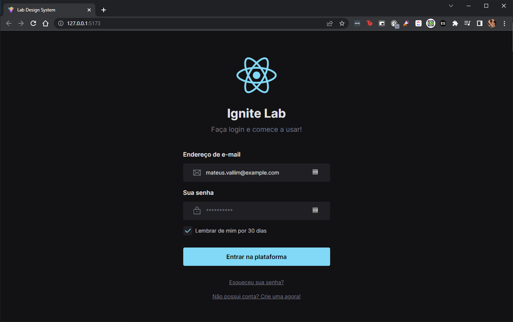
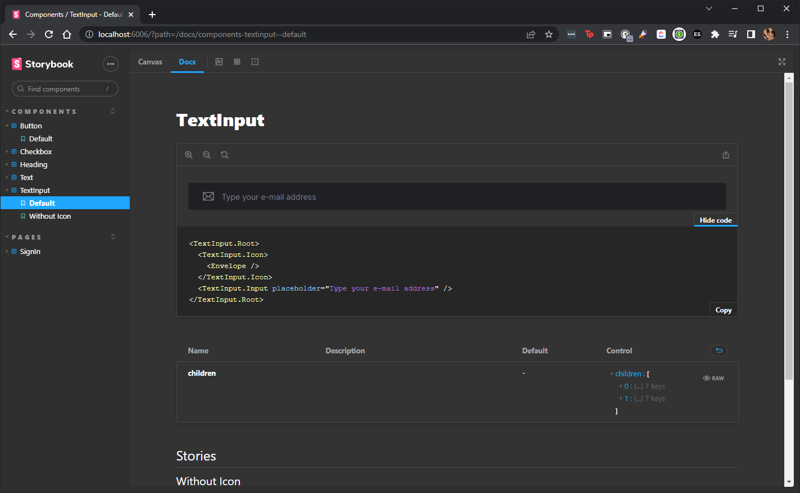

# Ignite Lab Design System

Este projeto foi baseado na semana de curso **Ignite Lab Design System** da **Rocketseat** na semana de 10 a 13/10/2022.

O projeto visa o estudo e aplicação de um Design System de 3 tópicos apresentados a seguir.

## 1. Figma 

Foi realizada a criação de um projeto no Figma com a criação de componentes, variáveis globais e design de uma tela de login.

<table style="width: 100%; border: 0">
    <tr style="padding: .15rem; border: 0">
        <td colspan=2 style="padding: .15rem; border: 0">
            
        </td>
    </tr>
    <tr style="padding: .15rem; border: 0">
        <td style="padding: .15rem; border: 0">
            
        </td>
        <td style="padding: .15rem; border: 0">
            
        </td>
    </tr>
</table>

Para acessar o projeto no Figma acesse [este link](https://www.figma.com/file/A5HJRqJ5FjwoZOPep8XrGF/Ignite-Lab-Design-Sistem?node-id=0%3A1).

## 2. ReactJS 

Com os componentes separados no Figma, foi possível a criação de uma aplicação com o ReactJS a partir de componentes JSX utilizando como base o `VITE v3.1.7`.



## 3. Storybook 

Com os componentes na pasta `./src/components/`, foi possível criar arquivos `*.stories.tsx` para indicar ao Storybook todo tipo de componente, detalhar suas respectivas variações e como utilizar cada uma com exemplos de códigos.

<table style="width: 100%; border: 0">
    <tr style="padding: .15rem; border: 0">
        <td style="padding: .15rem; border: 0; width: 22.2%">
            
        </td>
        <td style="padding: .15rem; border: 0; width: 77.8%">
            
        </td>
    </tr>
</table>

Também foi criada uma aba de páginas para que seja possível realizar testes com a biblioteca `msw` dentro do Storybook como mostra na imagem abaixo.


### 3.1 Github Pages

Após a criação do Storybook e seu detalhamento, este projeto foi enviado ao Github com uma configuração em `./.github/workflows/deploy-docs.yml` que permitiu que, a cada `git push` do projeto, o Github realizasse um deploy do Storybook na branch [`gh-pages`](https://github.com/vallimmateus/ignite-lab-design-system/tree/gh-pages) exibindo a documentação, criada em desenvolvimento, para uma produção individual no link [vallimmateus.github.io/ignite-lab-design-system/](https://vallimmateus.github.io/ignite-lab-design-system/).

---

## Como abrir o projeto

Para baixar o projeto para uma pasta `lab-ds`:

```Shell
git clone https://github.com/vallimmateus/ignite-lab-design-system.git lab-ds
cd lab-ds
npm install
```

Após o término do download e instalação de todas as dependências você pode:

- Executar o projeto em localhost

  ```Shell
  npm run dev
  ```

- Executar o Storybook em localhost

  ```Shell
  npm run storybook
  ```

- Realizar testes em todos os componentes com o Storybook
  ```Shell
  npm run storybook
  ```
